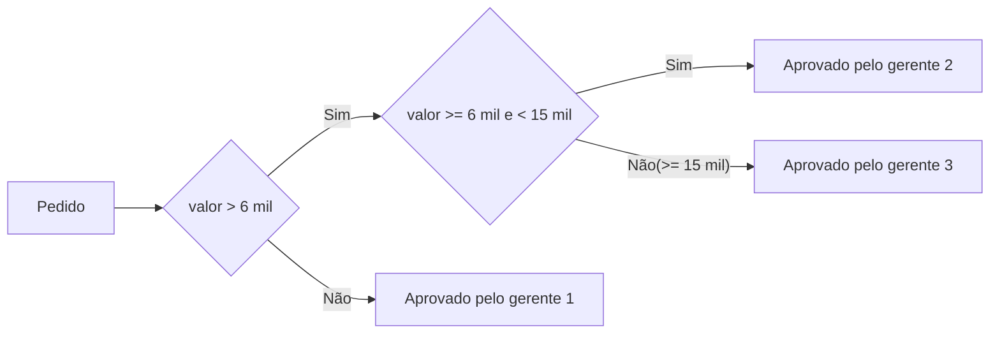
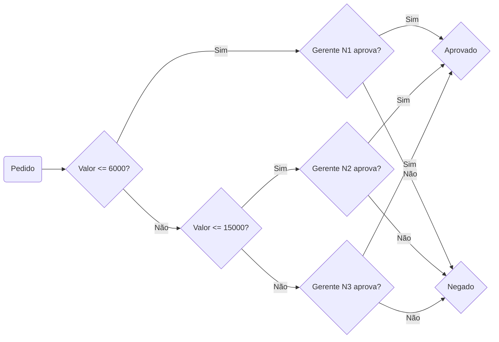

## DESIGN PATTERN - CHAIN OF RESPONSIBILITY

O padrão de projeto chain of responsibility (cadeia de responsabilidade) trata-se de um padrão comportamental.

> Os Padrões Comportamentais descrevem como classes e objetos interagem entre si.

| _**Definição popular:**_
O objetivo desse padrão é permitir que passemos solicitações ao longo de uma cadeia de objetos, onde cada um tem a oportunidade de tratar a solicitação.

## Definição mais simples - Entendendo na prática

**Cenário/sistema:** Sistema de pedidos de uma empresa

**Regras de negócio:** 
    
  - Pedidos de até 6 mil reais, podem ser aprovados pelo gerente de nível 1
  - Pedidos de 6 mil até 15 mil reais, devem ser aprovados pelo gerente de nível 2
  - Pedidos acima 15 mil reais, devem ser aprovados pelo gerente de nível 3

 

### Aprovação de um pedido

_Lógica simples - if e else:_

 
 

_Lógica elaborada - chain of responsibility:_

 
 

Analisando o diagrama vemos que:

- Definimos que o valor do pedido tem relação com qual gerente pode ou não aprova-lo

- Se o gerente responsável por aprovar ou recusar, independente da ação, nesse exemplo, encerra-se o fluxo.

- Se o valor não for correspondente ao gerente em questão, o pedido é passado para o próximo gerente, até que chegue no gerente responsável pela aprovação do pedido com o valor em questão ou não tenha um gerente definido para tal valor e o fluxo se encerra sem a aprovação do pedido.

 

| POR QUÊ?

**Lógica de Negócio:** Na maioria das implementações, a lógica é configurada para que, uma vez que um gerente nega o pedido, não há necessidade de consultar os demais. A decisão do primeiro gerente que negar o pedido é considerada final.

**Eficiência:** Evitar a consulta aos demais gerentes otimiza o processo, economizando tempo e recursos.

**Hierarquia:** A hierarquia dos gerentes implica que cada um tem um nível de autoridade específico. Se um gerente de nível inferior nega, não há motivo para consultar um gerente de nível superior para a mesma decisão.

 

`Para ver a aplicação de tudo mencionado e exemplificado até aqui, ver os arquivos na pasta 'src'.`

 
 

## Complementando detalhes sobre o padrão - revisar código para contexto

### Analisando as vantagens do padrão no exemplo utilizado

- **Desacoplamento:** A classe Pedido não sabe nada sobre os gerentes específicos, apenas sobre a interface Aprovador.

- **Flexibilidade:** A cadeia de aprovação pode ser facilmente configurada e modificada.

- **Extensibilidade:** Adicionar um novo nível de aprovação é simples, basta criar uma nova classe que implemente Aprovador.

- **Reutilização:** Os aprovadores podem ser reutilizados em outros contextos.

### Análise geral

**Sem o Padrão:** A lógica de aprovação está espalhada pela classe Pedido, tornando o código menos organizado e mais difícil de manter.

**Com o Padrão:** A lógica de aprovação está encapsulada em cada Aprovador, tornando o código mais modular e fácil de entender. O diagrama de fluxo mostra claramente como a solicitação é passada de um aprovador para outro até ser aprovada ou negada.

### Casos de melhor uso do padrão

- Processamento de requisições em sistemas web:
  - Filtros de autenticação, autorização e logging.
  - Processamento de diferentes tipos de requisições (GET, POST, etc.).

- Sistemas de logs:
  - Diferentes níveis de log (debug, info, warn, error) podem ser tratados por diferentes componentes.

- Validação de dados:
  - Diferentes regras de validação podem ser aplicadas em sequência.

- Gerenciamento de eventos:
  - Diferentes ouvintes podem ser notificados sobre um evento, cada um com uma ação específica.

- Roteamento de mensagens:
  - Mensagens podem ser encaminhadas para diferentes destinos com base em seu conteúdo.

- Fluxo de trabalho:
  - Aprovações sequenciais em um processo de negócio.

- Segundo o site <a href="https://refactoring.guru/pt-br/design-patterns/chain-of-responsibility/java/example#:~:text=Um%20dos%20casos%20de%20uso,os%20filtros%20de%20acesso%20seq%C3%BCencial.">refactoring.guru</a>: "Um dos casos de uso mais populares para o padrão é a interferência de eventos nos componentes pai nas classes da GUI. Outro caso de uso notável são os filtros de acesso sequencial."

### Considerações

**Desempenho:** A criação de muitas cadeias longas pode impactar o desempenho.

**Complexidade:** Em sistemas complexos, a configuração da cadeia pode se tornar complexa.